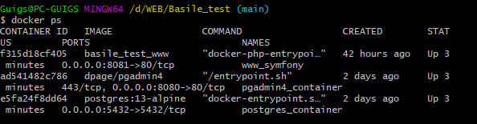
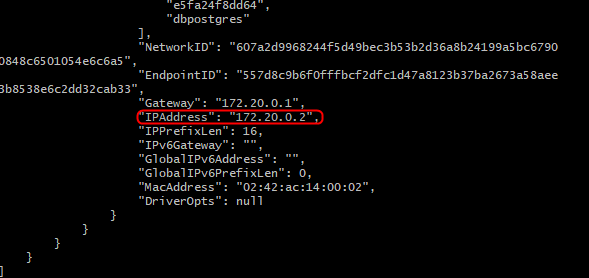
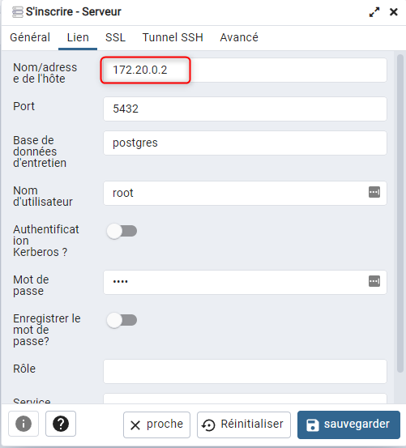
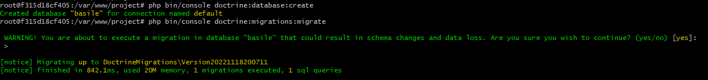

# basile-Guigs95

> Développer une interface simple de visualisation d'offres d'emploi en Symfony

Todo:
- [ ] Synchroniser via une commande les offres d'emploi publiées sur https://api.smartrecruiters.com/v1/companies/Basile1/postings
- [ ] Afficher la liste des offres sur une landing page
- [ ] Rediriger l'utilisateur sur le site carrière lorsqu'il clique sur une offre

Requirements:
- [ ] Stocker les offres dans une base de données locale PostgreSQL
- [ ] Utiliser le framework Symfony exclusivement


*La qualité du code et le respect des bonnes pratiques de développement sera le point d'attention principal.*

Author : Guillaume DOMINICI
### Stack
- Symfony 5.4.9
- Postgresql 13
- PgAmdin 4
- PHP 8.1

### Lancer l'application
```
# Dans le répertoire /project
$ composer install
# A la racine : pour démarrer le projet
$ docker-compose up --build -d
# Créer le serveur le BDD Postgresql
# On récupère le Container ID du container ayant le nom "postgres_container"
$ docker ps
```

```
# On récupère l'adresse IP du container en spécifiant l'id
$ docker inspect 'MON_CONTAINER_ID'
```

```
# rdv sur 127.0.0.1:8080 
# On créer un serveur avec l'adresse IP du container postregsql
# USER : root
# PASSWORD : root 
```

```
# Exécuter Doctrine
# A la racine du projet 
$ winpty docker exec -it www_symfony bash
$ cd projet
```

```
LE PROJET EST LANCé sur 127.0.0.1:8081
```

### Raisonnement
J'ai pris le partie d'enregistrer les données les plus importantes en fonction de la consigne. 

### Améliorations
- [ ] Enregistrer toutes les données de l'API
- [ ] Vérifier / Valider les données de l'API
- [ ] Si une offre est supprimer / editer de l'API -> Répercuter sur la base de données
